# VUE手机端商城

#### 项目介绍
Vue开发的手机端商城，使用Vant UI框架

#### 项目预览

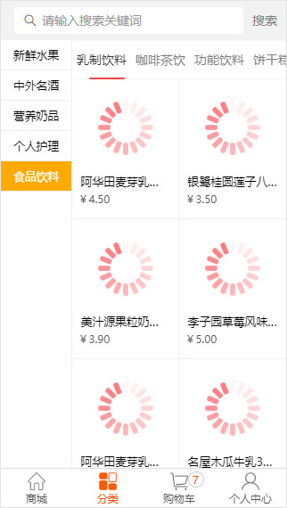
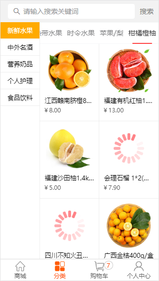
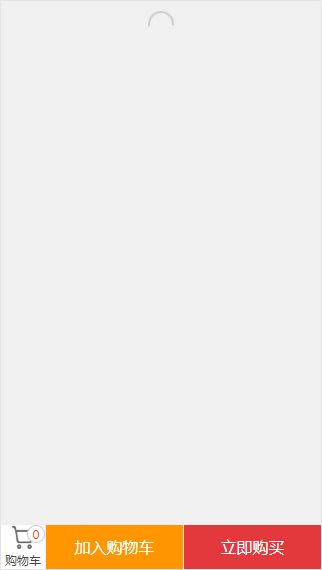

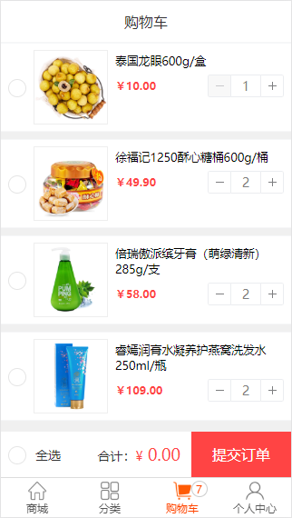
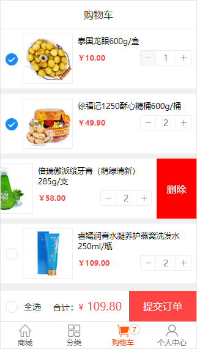
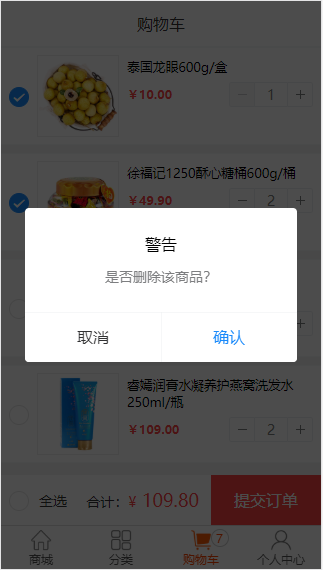

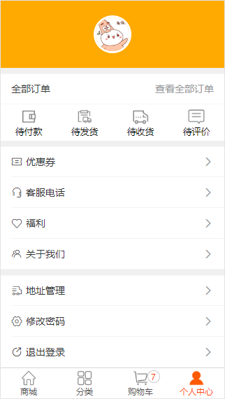
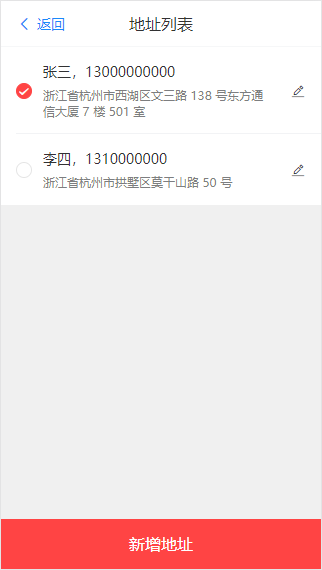
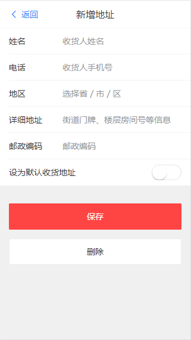
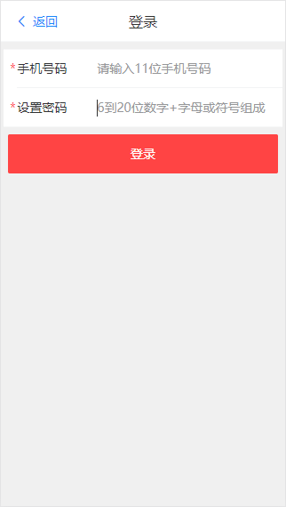
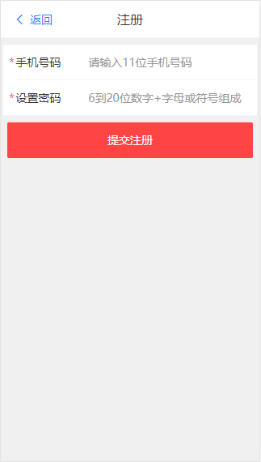

#### 软件架构
软件架构说明

- 后端
    - nodejs
- 前端
    - vue,vue-router,vuex
- 数据库
    - 无
- 服务器
    - nodejs-koa2
- 使用技术细分
    - axios,vue,vue-router,vuex,koa2,es6,es7[async-await],vant

#### 目录说明
- build vue配置目录
- config vue配置目录
- doc 项目相关目录
- service 后台功能目录
- src 源码
    - assets 静态资源
    - components 组件
    - filter 公共过滤方法
    - router 路由
    - store vuex仓库
    - App.vue 
    - main.js 入口文件
- static 静态资源目录
    - common 公共方法
    - data_json 数据json文件
    - model mongoose Schema模块
    - public 静态资源
    - routes api路由
    - app.js 启动文件
- .babelrc babel配置文件
- db.json json-server 文件
- index.html 容器

#### 安装教程
启动项目前先导入数据库
- 导入数据库
    - 安装mongodb 
    - 开启mongodb
    - 数据文件夹在doc文件夹内
    - mongodb导入：mongorestore -h dbhost -d dbname path 
    - dbhost是mongodb的IP，dbname是数据库的名字，path是doc里的数据库文件夹
    - 如下：
    - mongorestore -h 127.0.0.1 -d vuemall ./vuemall
- 开启项目
    - 开启后端服务器
        1. 确保mongodb已经开启
        2. 进入service目录
        3. npm install 或者 yarn install
        4. 注：mongodb链接可在service目录下的model目录下的db.js修改
    - 开启前端页面
        1. 在vuemall当前这个目录下
        2. npm install 或者 yarn install
        3. npm run dev 或者 yarn dev